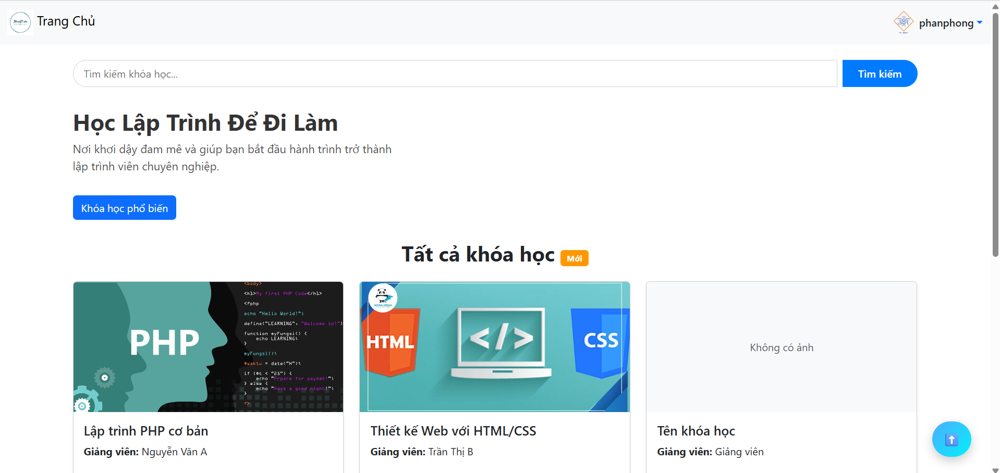
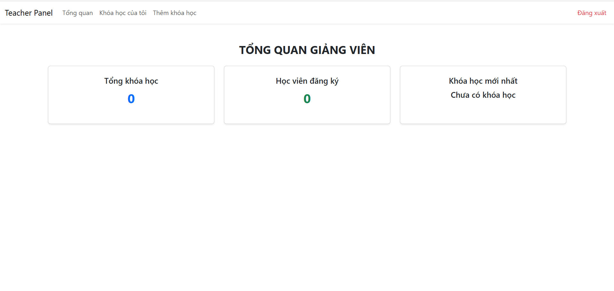

---
**© 2025 - Hệ thống Quản lý Học Online BTL**

<h2 align="center">
    <a href="https://dainam.edu.vn/vi/khoa-cong-nghe-thong-tin">
    🎓 Faculty of Information Technology (DaiNam University)
    </a>
</h2>

<h2 align="center">
    HỆ THỐNG QUẢN LÝ ĐĂNG KÝ KHÓA HỌC ONLINE
</h2>

<div align="center">
    <p align="center">
        
        
        
    </p>

[](https://www.facebook.com/DNUAIoTLab)
[](https://dainam.edu.vn/vi/khoa-cong-nghe-thong-tin)
[](https://dainam.edu.vn)

</div>

---

## 📖 1. Giới thiệu

Hệ thống quản lý đăng ký khóa học online là ứng dụng web được xây dựng bằng **PHP + MySQL**, giúp số hóa quy trình quản lý học tập, từ đăng ký khóa học, quản lý giảng viên đến quản trị hệ thống.  
Ứng dụng hỗ trợ ba nhóm người dùng chính: **Học viên, Giảng viên, Quản trị viên**.

---

## 🔧 2. Các công nghệ được sử dụng

<div align="center">

### Hệ điều hành
[](https://www.microsoft.com/windows)

### Công nghệ chính
[](https://www.php.net/)  
[](https://developer.mozilla.org/en-US/docs/Web/HTML)  
[](https://developer.mozilla.org/en-US/docs/Web/CSS)  
[](https://getbootstrap.com/)

### Cơ sở dữ liệu
[](https://www.mysql.com/)

</div>

---

## 🚀 3. Các chức năng chính

### 🖥️ Giao diện
- **Trang đăng nhập**  
  

- **Trang học viên**  
  

- **Trang giảng viên**  
  

- **Trang quản trị viên**  
  

### 👩‍🎓 Học viên
- Đăng ký tài khoản, đăng nhập  
- Xem danh sách & chi tiết khóa học  
- Đăng ký / Hủy đăng ký khóa học  
- Xem lịch học và trạng thái đăng ký  
- Cập nhật hồ sơ cá nhân  
- Thanh toán

### 👨‍🏫 Giảng viên
- Quản lý khóa học (Tạo mới, Chỉnh sửa, Xóa)  
- Quản lý nội dung bài học  

### 🛠️ Quản trị viên
- Quản lý người dùng (Tạo, Sửa, Xóa, Phân quyền)  
- Quản lý danh mục khóa học & toàn bộ hệ thống  
- Duyệt hoặc hủy đơn đăng ký  
- Xem thống kê, báo cáo (số lượng học viên, số khóa học, doanh thu mô phỏng)  

---

## ⚙️ 4. Cài đặt

### 4.1. Chuẩn bị môi trường
- Cài [XAMPP](https://www.apachefriends.org/) hoặc [Laragon](https://laragon.org/)  
- Cài [MySQL Workbench](https://dev.mysql.com/downloads/workbench/) để quản lý cơ sở dữ liệu  

### 4.2. Tải project
```bash
git clone <https://github.com/PhanPhong13112005/FIT4111-Open-Source-Software-Development.git>
```

### 4.4. Chạy dự án
- Mở trình duyệt và truy cập:  
  `http://localhost/FIT4111-Open-Source-Software-Development/`

---

## 👤 5. Tài khoản mẫu

- **Admin:**  
  - Tài khoản: `admin@gmail.com`  
  - Mật khẩu: `admin`
- **Giảng viên:**  
  - Tài khoản: `giangvien@gmail.com`  
  - Mật khẩu: `giangvien`
- **Học viên:**  
  - Tài khoản: `hocvien@gmail.com`  
  - Mật khẩu: `hocvien`

---

## 💡 6. Liên hệ & đóng góp

Nếu có vấn đề hoặc đóng góp, vui lòng liên hệ nhóm phát triển qua email hoặc Github.

---

**© 2025 - Hệ thống Quản lý Học Online BTL**
